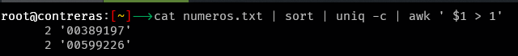

# Biblia Personal

Apuntes sobre comando en Linux y Powershell.

## HotKeys Windows Terminal

| Atajo           | Descripción                            					          |
|-----------------|-----------------------------------------------------------|
| Ctrl+C          | Copiar                                 					          |
| Ctrl+V          | Pegar                                  					          |
| Ctrl+A          | Seleccionar todo                       					          |
| Ctrl+Shift+V    | Pegar sin formato                      					          |
| Ctrl+Shift+C    | Copiar texto seleccionado al portapapeles (como Ctrl+C)   |
| Ctrl+Shift+X    | Cortar texto seleccionado              					          |
| Ctrl+T          | Abrir una nueva pestaña                					          |
| Ctrl+Tab        | Cambiar a la pestaña siguiente         					          |
| Ctrl+Shift+Tab  | Cambiar a la pestaña anterior          					          |
| Ctrl+Shift+T    | Reabrir pestaña cerrada                					          |
| Ctrl+W          | Cerrar la pestaña actual               					          |
| Ctrl+K          | Cortar texto seleccionado              					          |
| Ctrl+F          | Buscar                                 					          |
| Ctrl+Shift+F    | Buscar en todas las pestañas           					          |
| Ctrl+Plus       | Aumentar el tamaño de la fuente        					          |
| Ctrl+Minus      | Disminuir el tamaño de la fuente       					          |
| Ctrl+0          | Restablecer el tamaño de la fuente     					          | 
| Ctrl+Shift+Plus | Aumentar el zoom                       					          |
| Ctrl+Shift+Minus| Disminuir el zoom                      					          |
| Ctrl+L          | Limpiar la pantalla                    					          |
| Alt+Enter       | Alternar pantalla completa             					          |
| Alt+D           | Mover el cursor al campo de entrada    					          |
| Ctrl+Shift+V    | Pegar desde el portapapeles            					          |
| Ctrl+Shift+D    | Dividir la terminal en una nueva pestaña vertical 		    |
| Alt+Shift+D     | Dividir la terminal en una nueva pestaña vertical 		    |
| Alt+Shift+-     | Dividir la terminal en una nueva pestaña horizontal 	    |
| Ctrl+F3         | Buscar la siguiente ocurrencia         					          |
| Ctrl+Shift+F3   | Buscar la ocurrencia anterior          					          |


## Configurar SSH con Clave
- Crear las Claves con el comando en powershell ```ssh-keygen -t rsa -b 2048```.
- Copiar Clave Privada en path ```C:\Users\Cuenta\.ssh```.
- Copiar la Clave publica en el Servidor Linux a Controlar en el Archivo ubicado ```.ssh``` con el nombre ```~/.ssh/authorized_keys```.
- Modifcar el Comando en el json de code ```"commandline": "ssh -i C:\\Users\\Warshab\\.ssh\\NombreFile user@IP"```

## Configuraciones .Bashrc
- Alias Utiles.
  ```bash
    alias cl='clear'
    alias update='sudo apt update && sudo apt upgrade -y'
    alias sl='/usr/games/sl'
    alias meminfo='cat /proc/meminfo | grep MemTotal'
    alias ..='cd ..'
    alias ...='cd ../../'
    alias ....='cd ../../../'
    alias now='date +"%Y-%m-%d %H:%M:%S"'
    alias myip='curl http://ipinfo.io/ip;echo'
    alias count='echo "Numero de Archivos :" && ls -1 | wc -l'
    alias gogo='source ~/.bashrc'
  ```
## $ _ Bash Prompt Generator
-  Podemos personalizar el prompt de nuestra terminal con esta pagina web   ```https://bash-prompt-generator.org/```
  
   ```bash
   PS1='\[\e[97;1m\]\u\[\e[97m\]@\[\e[97m\]\h\[\e[0m\]:\[\e[91m\][\[\e[38;5;220m\]\w\[\e[91m\]]\[\e[0m\]--\[\e[1m\]>\[\e[0m\]'
   ```
   ```bash
   PS1='\[\e[97;1m\]\u\[\e[97m\]@\[\e[97m\]\h\[\e[0m\]:\[\e[91m\][\[\e[38;5;220m\]\w\[\e[91m\]]\[\e[38;5;35;1m\]-->\[\e[0m\]'
   ```
   
## Calculos Aritmeticos con Terminal

- Usando ```expr``` Ejemplos.

  ```bash
      expr 2 + 3
      expr 2 - 1
      expr 2 \* 2
      expr 10 / 2
  ```
- Usando Bash con ```$((expresión))``` Ejemplo.

  ```bash
      echo $((2 + 2))
      echo $((2 - 1))
      echo $((2 * 2))
      echo $((10 / 2))
  ```

## Eliminar Mensajes Bienvenida al Conectar x SSH
- Modificar Archivo ```/etc/motd``` puedes poner el mensaje que quieras.
- Eliminar los archivos del Directorio ```/etc/update-motd.d/*``` por lo general solo hay uno con el comando ```uname -r```.

## Paquetes en Linux
- Buscar Paquetes ```sudo apt search openssh-server```.
- Otra forma de buscar paquetes ```dpkg -s top```.
- Instalar Paquetes manual ```sudo dpkg -i paquete.deb```.
- Eliminar paquete instalado ```sudo apt remove paquete```.
- Listar todos los paquetes instalados ```dpkg -l```.
- Comprobar la version del Kernel ```uname -sr```.
- Actualizar Kernel ```sudo apt dist-upgrade``` que equivale a un ```sudo apt upgrade```.


### Repositorio Kali en Debian

- Url Repo Kali (https://www.kali.org/docs/general-use/kali-linux-sources-list-repositories/)
   

  ```
  deb http://http.kali.org/kali kali-rolling main contrib non-free non-free-firmware
  ```
- Se recomienda agregar el repositorio en esta ruta ```/etc/apt/sources.list.d/``` y no en el fichero ```/etc/apt/sources.list```. Se puede hacer con el siguiente comando.
  ```bash
   sudo add-apt-repository "deb http://http.kali.org/kali kali-rolling main contrib non-free non-free-firmware"
  ```

- Se puede desscargar la clave publica GPG de Kali con el siguiente comando.
  ```bash
  wget  https://archive.kali.org/archive-key.asc 
  ```
- Para convertir el archivo ```archive-key.as```  a un archivo ```.gpg``` se realiza con el siguiente comando.
  ```bash
  gpg -o kali-key.gpg --dearmor archive-key.asc
  ```
- Ahora podemos copiar el archivo en la ruta : ```/etc/apt/keyrings/```
  ```bash
  cp kali-key.gpg /etc/apt/keyrings/
  ```
- Ahora ya podemos modificar el archivo generado en ```/etc/apt/sources.list.d/``` Archivo ```archive_uri-http_http_kali_org_kali-bookworm.list```.

- Ahora Modificamos el archivo con la siguiente Linea
  ```bash
  deb [signed-by=/etc/apt/keyrings/kali-key.gpg] http://http.kali.org/kali kali-rolling main contrib non-free non-free-firmware
  ```
- Ahora ya podemos ejecutar el update.

  ```sudo apt update && sudo apt upgrade -y```  or ```sudo apt full-upgrade```

- Instala las herramientas de Kali.
  ```bash
  sudo apt install kali-linux-default
  ```
### Repositorios Github 
- ```https://github.com/akr3ch/BugBountyBooks.git``` Libros BugBountyBooks.
- ```https://github.com/zacheller/rockyou.git``` Wordlist Rockyou.
- ```https://github.com/rebootuser/LinEnum.git``` Validar este repositorio en VM Proxmox.
  
## Sistema Operativo

### Directorios Importantes

 - ```/etc/password```    Contiene la informacion de Usuarios.
 - ```/etc/shadow```      Contiene la informacion de contraseñas de los usuarios.
 - ```/etc/group```       Contiene la informacion de grupos y sus usuarios.
 - ```/etc/resolv.config``` Configurar DNS. Se puedo validar el DNS que utiliza el Sistema con el comando dig. Modificacion Temporal.
 - ```/etc/apt/sources.list``` Archivo de repositorios del sistema.
 - ```/etc/profile```      Permite definir variables de entorno y scripts, aunque no es apropiado modificar este fichero directamente (debe crearse un nuevo fichero en /etc/profile.d). Se ejecuta en shells con login.
 - ```/etc/bash.bashrc``` Permite definir variables de entorno y scripts que estarán disponibles para programas iniciados desde la shell bash. Las variables que se definan en este fichero no van a estar disponibles para programas iniciados desde la interfaz gráfica. No se ejecuta en shells con login.
 - ```~/.profile``` Permite definir variables de entorno y scripts. Este fichero se ejecutará al iniciar la sesión de Escritorio o en una shell con login. Las variables afectan a todos los programas ejecutados desde el escritorio gráfico o desde la shell.
 - ```~/.bashrc``` Permite definir variables de entorno y scripts. Se ejecuta cuando se abre la shell sin necesidad de hacer login. 

### Variables de Entorno
 -  Mostrar lista de variables de Entorno. ```printenv```.
### Funciones de Entorno
 -  Para ver todas las funciones que tenemos podemos ejecutar ```set``` y este nos mostrara las diferentes configuraciones que tenemos.
# Networking 
 - Saber mi IP Publica ```curl icanhazip.com```.
 - Mostrar estadisticas de Conecciones  ```ss -ta``` Muestra los Sockect TCP  ```ss -tu``` Muestra los Sockect UTP.
 - Comando para localizar puerto en uso y el proceso que lo esta utulizando ```sudo ss -lptn 'sport = :8080'```.
 - Mostrar tablas de rutas de nuestra PC  ```netstat -nr```.
 - Mostrar Conecciones TCP ```netstat -at```.
 - Mostrar Conecciones UTP ```netstat -au```.
 - Mostrar Conecciones en Escucha ```netstat -l```.
 - Mostrar Conecciones Establecidas ```netstat -pntu```.

## Servicios en Ejecucion Debian
  Con este comando podemos ver todos los servicios que estan en ejecucion en nuestro sistema.
```
systemctl list-units --type=service
```

## Crontab en Linux  ```crontab -e```

Crontab es una herramienta de programación de tareas en Linux que permite ejecutar scripts o comandos en momentos específicos de manera automática. La tabla siguiente resume su sintaxis y opciones:

| Campo             | Valor                  | Descripción                                          |
|-------------------|------------------------|------------------------------------------------------|
| Minuto            | `0-59`                 | El minuto en el que se ejecutará la tarea.           |
| Hora              | `0-23`                 | La hora en la que se ejecutará la tarea.             |
| Día del mes       | `1-31`                 | El día del mes en el que se ejecutará la tarea.      |
| Mes               | `1-12` o `Jan-Dec`     | El mes en el que se ejecutará la tarea.              |
| Día de la semana  | `0-7` o `Sun-Sat`      | El día de la semana en el que se ejecutará la tarea. |
| Comando           | `/path/to/command`     | El comando o script que se ejecutará.                |

### Caracteres Especiales en Crontab

| Carácter | Descripción                                                                            |
|----------|----------------------------------------------------------------------------------------|
| `*`      | Representa "cada" unidad de tiempo (cada hora, cada día, etc.)                         |
| `,`      | Permite especificar una lista de valores (p.ej., `1,3,5`).                             |
| `-`      | Define un rango de valores (p.ej., `1-5`).                                             |
| `/`      | Especifica un intervalo de tiempo (p.ej., `*/10` para "cada 10 minutos").              |


### Ejemplos de Crontab

```cron
# Ejecuta `backup.sh` a las 2:30 AM todos los días
30 2 * * * /path/to/backup.sh

# Ejecuta un script cada 15 minutos
*/15 * * * * /path/to/script.sh

# Ejecuta `logs.sh` a las 3 PM los lunes
0 15 * * 1 /path/to/logs.sh
```


## Buscar | Priorizar | Matar Procesos Sistema

- Buscar procesos por nombre:
  ```bash
    pgrep openvpn
  ```
- Matar un proceso por medio del PIP
  ```bash
    sudo kill -9 PID
  ```
- Matar un proceso por medio del nombre:
  ```bash
    sudo pkill openvpn
  ```
- Detener procesos ```Ctrl+z``` 
  ```bash
  Ctrl+z
  ```
  
- Ejecutar un proceso en segundo plano.
  ```bash
  ./infinito.sh &
  ```
- Ejecutar programa en un solo CPU y en segundo plano.
  ```bash
  taskset --cpu-list 1 ./infinito.sh &
  ```
- Nice y Renice procesos (A mayor numero mas amigable con los otros procesos) ```-20``` Mayor Prioridad  ```20``` Menor Prioridad.
  -- Nice
  ```bash
  taskset --cpu-list 1 nice -n 10 ./infinito.sh &  
  ```
  -- Renice | Si se debe de dar mas prioridad puede que solicite permisos en caso contrario sin problemas.
  ```bash  
   renice 10 -p #proceso    
  ```
  


## Comando TOP

- Al presionar la tecla ```s``` este nos permite cambiar la velocidad de actualizacion.
- Filtrar procesos por el nombre del Usuario ```u```.
- Cambiar valores de medicion a Megas | Gigas etc  ```e```.
- Filtrar los procesos por alguna de las columnas disponibles ```o```  escribimos el nombre de la columna seguido del ```=``` mas el valor a buscar ```COMMAND=top``` para regresar    con solo presionar la tecla ```=```.

 ## Expresiones Regulares

  

- Importante Manejar Expresiones regulares en Notepad++ (```https://www.youtube.com/playlist?list=PL1z4RL0Mc_2UEn-9qHIIT_P1jN0nwde2f```)
- Web para generar y probar expresiones regulares(```https://regex101.com/```)
 ## Comando AWK 

  ### Variables Incorporadas AWK
  | Variable | Descripción |
|----------|-------------|
| `NR`     | Número de registro actual, típicamente el número de línea procesada hasta el momento. |
| `NF`     | Número de campos en el registro actual. |
| `$0`     | Toda la línea de entrada actual. |
| `$1`, `$2`, ..., `$n` | El primer, segundo, ..., n-ésimo campo de la línea actual, respectivamente. |
| `FS`     | Separador de campos (Field Separator), espacio en blanco por defecto. |
| `RS`     | Separador de registros (Record Separator), una nueva línea por defecto. |
| `OFS`    | Separador de salida de campos (Output Field Separator), utilizado para formatos de salida. |
| `ORS`    | Separador de salida de registros (Output Record Separator), utilizado en la salida de datos. |


  ### Ejemplos

  - Buscar datos basados en la columna # 4, donde esta sea menor igual a 100 (```$4<=100```). Este Comando  ```%-20s``` Indica que Genere un espacio para la primer columna de 20  y el ```\n``` es el Salto de linea.
   ```bash
   awk -F, '$4<=100 {printf "%-30s %-5s\n", $1,$3}' fake_data.txt
   ```
  - Para los casos en que se desea sumar una columna podemos usar el siguiente Comando:
   ```bash
   awk -F, '{ suma += $4 } END {print "La Suma es de : " suma}' fake_data.txt
   ```
   
  - Para los casos en que se desea Contar una columna podemos usar el siguiente Comando:
   ```bash
   awk -F, '{ count++ } END {print "La cuenta es de : " count}' fake_data.txt
   ```
   
   - Para saber el tamaño de una columna usar el Comando:

   ```bash
   awk -F, '{print $1, "La Colunma $1 tiene una logitud de :", length($1) }' fake_data.txt | head -2
   ```
   

   - Buscar las shell disponibles diferentes del archivo passwd ```$NF```  Significa Ultima Columna o ultimo campo de Linea segun el delimitador establecido al inicio con ```-F```

   ```bash
   awk -F':' '{print $NF}' /etc/passwd | sort | uniq
   ```
   - Ordenar Lista de Numero y Saber cuales estan repetidos.

   ```bash
   cat numeros.txt | sort | uniq -c | awk ' $1 > 1'
   ```
   
   

## Comando Grep $ zgrep

 - Buscar una cadena y seleccionar las posiciones que se necesitan devolver de esa fila.
   ```
   zgrep "Mensaje recibido" *.log.gz | awk '{print substr($0,196,21), substr($0, otro_inicio, otro_largo)}'
   ```
   

 - Para casos en los que se necesita tener un mensaje cuando no se encuentre resultados con el ```grep``` o ```zgrep``` podemos usar el siguiente comando:
    ```bash
    grep "Mensaje" *.log || echo "No se encontraron Datos."

    ```
 

## Practicas Comandos

 -

## Problemas al instalar Tarjeta Video NVIDIA GTX 1650 

Mensaje Error : ```WARNING: The Nouveau kernel driver is currently in use by your system.  This driver is incompatible with the NVIDIA driver, and must be disabled before proceeding.```
- Crear un archivo de configuración para el kernel.
- Instalar estos paquetes necesarios primero.
  ```
  #Requeridos
  sudo apt-get install linux-headers-$(uname -r)
  sudo apt install firmware-linux firmware-linux-nonfree
  sudo apt-get update
  sudo apt-get install pkg-config
  sudo apt-get install software-properties-common
  sudo apt install build-essential
  sudo apt update
  sudo apt install -y build-essential tk-dev libncurses5-dev libncursesw5-dev libreadline6-dev libdb5.3-dev libgdbm-dev libsqlite3-dev libssl-dev libbz2-dev libexpat1-dev liblzma-dev zlib1g-dev libffi-dev
  sudo apt-get install -y build-essential libssl-dev git zlib1g-dev yasm libgmp-dev libpcap-dev pkg-config libbz2-dev
  sudo apt-get install wireless-tools   # iwconfig
  sudo apt-get install net-tools        # ifconfig -a
  sudo apt-get install network-manager  # nmcli dev wifi list  Lista de Wifis

  #Aplicaciones
  sudo apt install bsdmainutils
  sudo apt install lm-sensors
  sudo apt install psensor
  sudo apt install glances
  ```
- Debes crear un archivo de configuración en el directorio /etc/modprobe.d/ para indicarle al sistema que no cargue el módulo Nouveau. Puedes hacerlo con el siguiente comando:
  ```
  sudo echo "blacklist nouveau" >> /etc/modprobe.d/blacklist-nouveau.conf
  ```
- Además, agrega la opción nomodeset para prevenir que el kernel cargue Nouveau antes de que se aplique la lista negra. Agrega la siguiente   línea al mismo archivo:
  ```
  sudo echo "options nouveau modeset=0" >> /etc/modprobe.d/blacklist-nouveau.conf
  ```
- Necesitas actualizar la configuración de GRUB, el cargador de arranque, para asegurarte de que se aplique la configuración de la lista negra. Abre el archivo de configuración de GRUB con un editor de texto:
  ```
  sudo nano /etc/default/grub
  ```
  Busca la línea que comienza con GRUB_CMDLINE_LINUX_DEFAULT y añade nouveau.modeset=0 al final de las comillas. Por ejemplo, si la línea era:
  ```
  GRUB_CMDLINE_LINUX_DEFAULT="quiet"
  ```
  Deberías cambiarla a:
  ```
  GRUB_CMDLINE_LINUX_DEFAULT="quiet nouveau.modeset=0"
  ```
- Guarda y cierra el archivo. Luego, actualiza la configuración de GRUB con:
  ```
  sudo update-grub
  ```
- Para asegurarte de que los cambios tomen efecto en el próximo arranque, regenera el initramfs con el siguiente comando:
  ```
  sudo update-initramfs -u
  ```
- Después de realizar estos cambios, reinicia tu sistema para aplicarlos:
  ```
  sudo reboot
  ```
- Validar si esta Instalado Correctamente
  ```
  nvidia-smi
  ```
- Instalar Cuda Drivers
  ```
  wget https://developer.download.nvidia.com/compute/cuda/12.4.0/local_installers/cuda_12.4.0_550.54.14_linux.run
  sudo sh cuda_12.4.0_550.54.14_linux.run
  ```
  
  
## Programas Top
- ```htop``` Monitor de Procesos.
- ```btop``` Monitor de Procesos mas moderno.
- ```figlet``` Genera texto con letras grandes en terminal.
- ```cmatrix```Wallpaper Matrix en Terminal.
- ```mtr``` Permite realizar un seguimiento de la ruta que toma un paquete de datos desde tu computadora hasta un destino específico en la red, al mismo tiempo que muestra información sobre la latencia y la pérdida de paquetes en cada salto de la red.
- ```sl``` El tren en la terminal ```sudo apt install sl``` podemos crear un alias ```alias sl='/usr/games/sl'``` en ```.bashrc```.

## Manejo de Entorno Linux

#### Reconfigurar Zona Horaria en Debian

```bash
dpkg-reconfigure tzdata
```
#### Reiniciar Red Linux (Debian)
```bash
sudo systemctl restart networking.service
```

#### Reiniciar SSH (Debian)
```bash
sudo systemctl restart sshd
```
#### Permitir Root SSH (Modificar Archivo /etc/ssh/sshd_config) Habilitar Linea ```PermitRootLogin yes```
```bash
sudo nano /etc/ssh/sshd_config
```

#### Status Red Linux (Debian)
```bash
sudo systemctl status networking.service
```
#### Configurar Red Linux (Debian)
```bash
sudo nano /etc/network/interfaces
```

## Manejo de Zip | Unzip en Linux

### Instalar Zip y Unzip

```bash
sudo apt install zip unzip
```
### Comprimir Archivo
```bash
zip archivo_comprimido.zip archivo_a_comprimir.txt
```
```
 gzip file
```
### Comprimir Directorio
```bash
zip -r archivo_comprimido.zip directorio_a_comprimir/
```
```
gzip -r directorio  // comprime los archivos dentro del directorio no la carpeta
```
### Descomprimir Archivo
```bash
unzip archivo_comprimido.zip
```
```
gunzip file.gz
```
### Descomprimir en Directorio
```bash
unzip archivo_comprimido.zip -d /ruta/del/directorio/
```
### Descomprimir Archivos tar ejemplo (rockyou.txt.tar.gz)
 - -x: indica a tar que extraiga los archivos.
 - -z: le dice a tar que descomprima el archivo (ya que está comprimido con gzip).
 - -v: significa "verbose", lo que hace que tar muestre los archivos a medida que se extraen (esto es opcional, pero útil para ver lo que está sucediendo).
 - -f: le dice a tar que el siguiente argumento es el nombre del archivo a procesar, en este caso, rockyou.txt.tar.gz.
```bash
   tar -xzvf rockyou.txt.tar.gz
```


## Comandos Utiles

### Contar Filas | Palabras | byte de un Archivo (wc -l = Lineas) (wc -w = Palabras) (wc -c = byte)
```bash
wc miarchivo.txt
```
Ejemplo:
```
12 42 256 miarchivo.txt
```
Lineas = ```wc -l ```
Palabras = ```wc -w```
Caracteres = ```wc -m```

## Como Instalar PhpMyAdmin Ubuntu 20.04 LTS

### Ejecutar los Siguientes Comandos

#### Actualiza lista de paquetes
```
sudo apt update
```
#### Instala PhpMyAdmin
```
sudo apt install phpmyadmin
```

#### Habilitar la Extensión PHP mcrypt y mbstring
```
sudo apt install php-mbstring php-zip php-gd php-json php-curl
sudo phpenmod mbstring
```
#### Reiniciar Apache
```
sudo systemctl restart apache2

```

### Aumentar Limite a la hora de importar Archivos

Se debe de buscar el archivo `php.ini`  con el comando `find`  en el servidor

Ruta 
```
/etc/php/7.4/apache2/php.ini
```

Cambia los siguientes valores:

`upload_max_filesize` Este valor define el tamaño máximo de archivo que se puede subir. Establécelo según tus necesidades, por ejemplo, 64M para un límite de 64 megabytes.
`post_max_size` Este valor debe ser mayor o igual que `upload_max_filesize`. Habitualmente se establece un poco más alto que `upload_max_filesize`.
`max_execution_time` y `max_input_time` : Estos valores controlan el tiempo máximo que PHP espera para la ejecución de scripts y la entrada de datos, respectivamente. Puedes aumentarlos según sea necesario.


## Python AI

## Instalar Python
```bash
sudo apt install python3 python3-pip

```
### Paquete para Crear Enviroment
```bash
sudo apt install python3-venv
```
### Crea Entorno 
```bash
python3 -m venv mi_entorno

```
### Activar Entorno
```bash
source mi_entorno/bin/activate

```
### Instalar Librerias
```bash
pip install matplotlib seaborn
pip install tensorflow
pip install tensorflow-gpu

```

